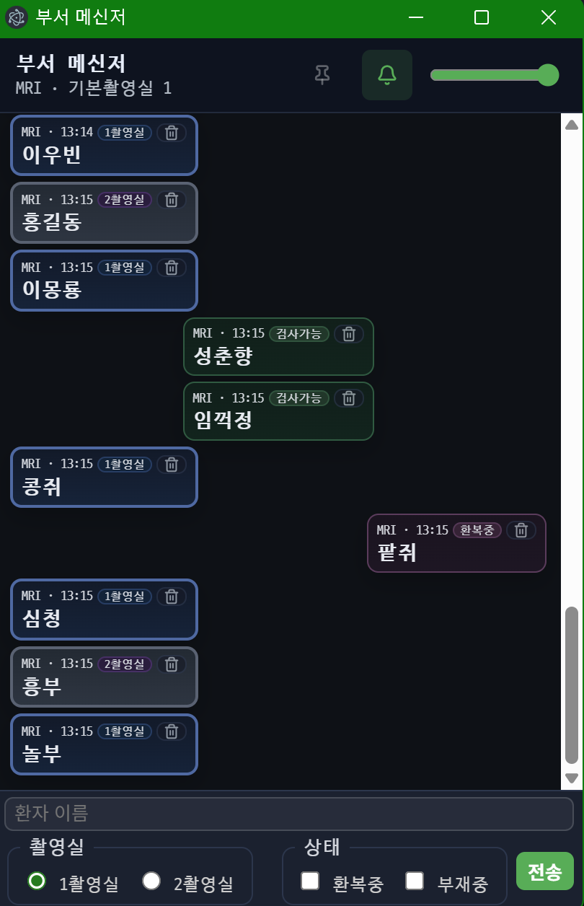

# Rad Messenger

Electron 기반 데스크톱 클라이언트와 Node.js 서버로 구성된 실시간 메신저입니다. 병원 영상의학과 등 내부 네트워크 환경에서 단순·신속한 커뮤니케이션을 목표로 합니다.



## 구성 개요
- 클라이언트: Electron 앱 (`client/`)
  - 실시간 메시지 표시, 상태 토글(검사가능/환복중/부재중), 알림음, 항상위 기능
  - 설정은 개발 중에는 `client/config.json`, 설치본은 `C:\\ProgramData\\RadMessenger\\client\\config.json`
- 서버: Express + Socket.IO + SQLite (`server/`)
  - 이벤트 브로드캐스트, 간단한 히스토리 조회 API, 로컬 `better-sqlite3` 영속화

## 요구사항
- Node.js 18 이상 권장 (서버/클라이언트 개발용)
- Windows (배포 타깃, NSIS 인스톨러)

## 빠른 시작

### 1) 서버 실행
```bash
cd server
npm install
npm start
# 기본 포트: 3030
```
Windows 트레이로 백그라운드 실행하려면 `server/start-server.ps1` 바로가기를 만들어 사용하세요. 예시:
```powershell
powershell.exe -WindowStyle Hidden -ExecutionPolicy Bypass -File "C:\\Users\\<USER>\\Documents\\rad-messenger\\server\\start-server.ps1"
```

### 2) 클라이언트(개발 모드) 실행
```bash
cd client
npm install
npm run start
```

## 설정(클라이언트)
클라이언트는 다음 경로의 JSON을 우선순위대로 읽습니다.
1. 개발용: `client/config.json`
2. 시스템: `C:\\ProgramData\\RadMessenger\\client\\config.json` (설치본 최초 실행 시 기본값 자동 생성)
3. 리소스 내 기본값: `config.default.json`

예시 스키마:
```json
{
  "serverUrl": "http://192.168.10.70:3030",
  "displayName": "MRI",
  "defaultRoom": "1",
  "alwaysOnTop": false,
  "soundEnabled": true,
  "soundVolume": 1.0
}
```

메모
- 설치본은 `C:\\ProgramData\\RadMessenger\\client\\config.json`이 없으면 첫 실행 시 자동 생성됩니다.
- CSP는 `serverUrl`에 맞춰 동적으로 설정됩니다.

## 서버 API/이벤트 요약
- HTTP
  - `GET /` 서버 상태 확인
  - `GET /history?limit=100&offset=0` 과거 메시지 조회(최대 500)
- Socket.IO 이벤트
  - `chat:send` { sender, text, room?, status?, ts? } → 저장 후 `chat:new` 브로드캐스트({ id, ... })
  - `chat:update` { id, room?, status? } → 갱신 브로드캐스트
  - `chat:delete` { id } → 삭제 브로드캐스트

## 빌드(배포용 인스톨러)
Electron 인스톨러는 `electron-builder`를 사용합니다.
```bash
cd client
npm install
npm run build
# 산출물: client/dist/RadMessenger-Setup-<version>.exe
```
버전은 `client/package.json`의 `version` 필드로 관리합니다.

## 릴리즈(깃허브)
1. 태그 생성/푸시: `git tag vX.Y.Z && git push origin vX.Y.Z`
2. GitHub CLI(gh)로 릴리즈 생성/업로드:
   ```powershell
   $gh = 'C:\\Program Files\\GitHub CLI\\gh.exe'
   $tag = 'vX.Y.Z'
   $asset1 = "client\\dist\\RadMessenger-Setup-X.Y.Z.exe"
   $asset2 = "client\\dist\\RadMessenger-Setup-X.Y.Z.exe.blockmap"
   & $gh release create $tag $asset1 $asset2 --title "Rad Messenger $tag" --notes "릴리즈 노트"
   # 기존 릴리즈 업데이트 시: gh release upload $tag $asset1 $asset2 --clobber
   ```

## 트러블슈팅
- 방화벽: 서버 포트 `3030/TCP` 개방 필요(내부망 기준)
- 권한: 설치본이 `C:\\ProgramData`에 설정 파일을 생성/수정할 수 있어야 함
- 서버 프로세스: `start-server.ps1`로 실행 중 재시작/종료는 트레이 메뉴에서 수행
- 소켓 연결 안 됨: `serverUrl`(프로토콜/호스트/포트) 확인

## 디렉터리 구조
```
client/   # Electron 앱 소스 및 빌드 설정
server/   # Express + Socket.IO 서버 및 SQLite DB
```

## 라이선스
사내 용도 기준. 외부 배포 시 별도 라이선스 명시 필요.
